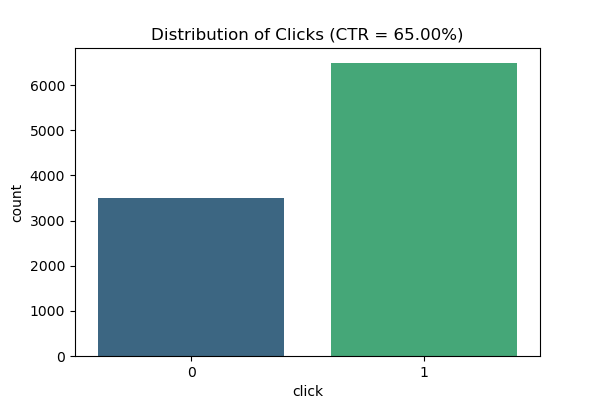
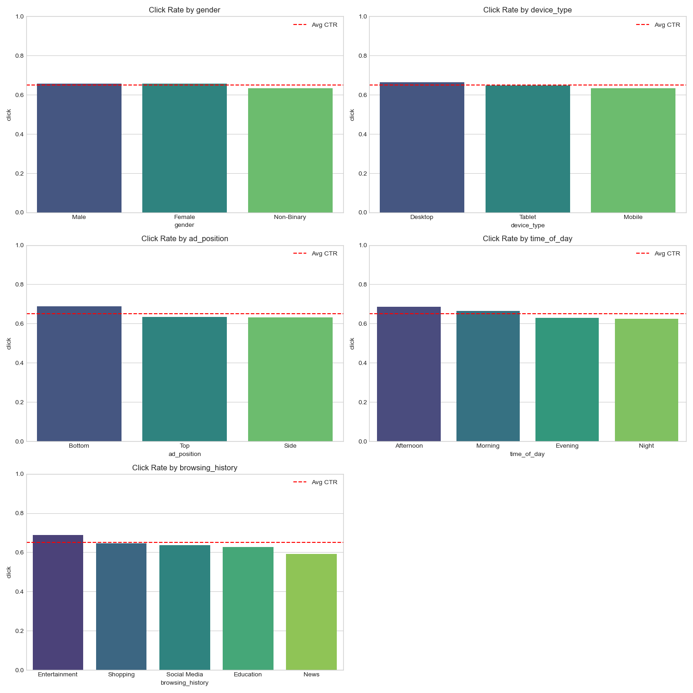
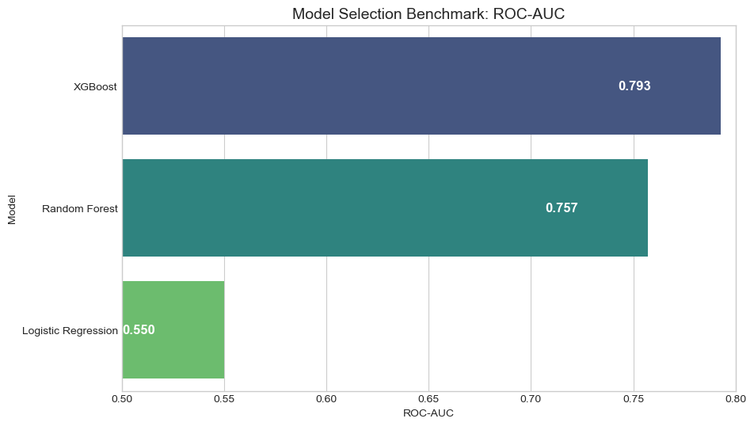
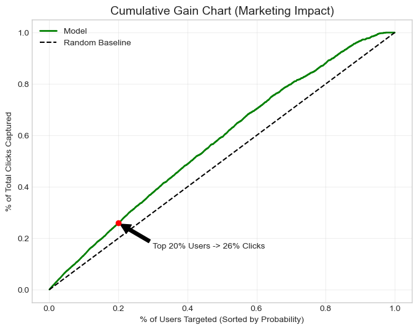
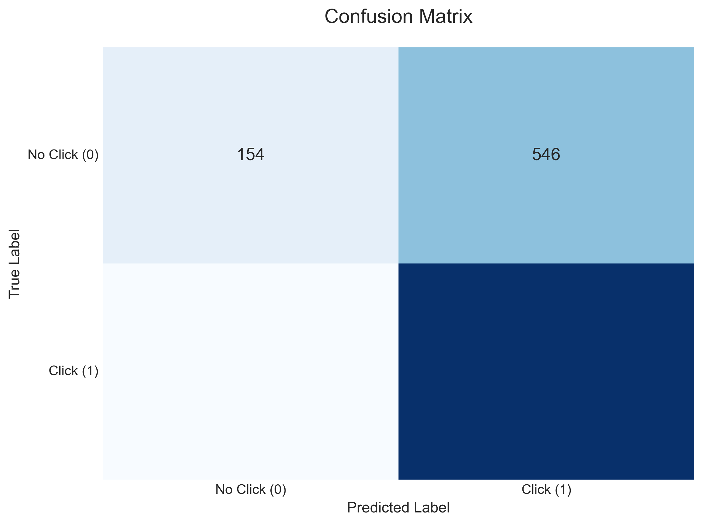

# Ad Click Prediction with Cloud-Integrated Pipeline ☁️


---
## Table of Contents

- [Executive Summary](#1-executive-summary)
- [Infrastructure & Tech Stack](#2-infrastructure--tech-stack)
- [Data Intelligence & Strategy](#3-data-intelligence--strategy)
- [Modelling Methodology](#4-modelling-methodology--selection)
- [Model Results & Business Evaluation]()
- [Explainable AI: The "Why" Behind Clicks]()
- [Recommendations]()

---

## 1. Executive Summary
**Business Objective:**
In the competitive landscape of digital advertising, minimising wasted ad spend is paramount. This project aims to construct a machine learning pipeline capable of predicting user **Click-Through Rates (CTR)**. By identifying high-propensity user segments, the model enables more efficient budget allocation and targeted marketing strategies.

**The Solution:**
I engineered an end-to-end Modern Data Stack simulation:
1.  **Cloud ETL:** Ingested raw data via **Google BigQuery** data warehouse.
2.  **Data Strategy:** Implemented a "Missingness as Signal" strategy to handle 47% missing demographic data without information loss.
3.  **Rigorous Modelling:** Conducted a champion-challenger benchmark, selecting **XGBoost** over Logistic Regression for its superior ability to capture non-linear user behaviours.

**Key Result:**
The final model achieves an **ROC-AUC of 0.71**. Implementing this model to target the top 20% of users yields a **1.3x Lift** in click capture rate compared to random targeting, representing a potential **30% efficiency gain** in ad spend.

---

## 2. Infrastructure & Tech Stack
The project is built on a cloud-first architecture to ensure scalability and reproducibility.

* **Data Warehouse:** Google BigQuery (Sandbox Environment)
* **ETL Pipeline:** Python (`google-cloud-bigquery`) for secure data extraction and transformation.
* **Modelling:** Scikit-Learn & XGBoost (Planned).
* **Explainability:** SHAP (SHapley Additive exPlanations) for model transparency.
* **Authentication:** Service Account security with environment variable management.

### 🏗️ Cloud Integration Evidence
*The following execution plan demonstrates the SQL query performance within the BigQuery console, confirming data integrity before extraction.*

```sql
/*
 * QUERY: Initial Data Quality Check
 * OBJECTIVE: Assess dataset balance and identify potential null values before ETL.
 * AUTHOR: Chien-Hao Wang
 */

SELECT
    COUNT(*) AS total_impressions,
    COUNTIF(click = 1) AS total_clicks,
    ROUND(COUNTIF(click = 1) / COUNT(*) * 100, 2) AS ctr_percentage,
    COUNTIF(age IS NULL) AS missing_age_records,
    COUNTIF(gender IS NULL) AS mssing_gender_records
FROM
    `marketing_data.ad_clicks_raw`;
```

---

## 3. Data Intelligence & Strategy

### A. Dataset Characteristics
* **Source:** Multi-channel digital advertising impressions.
* **Volume:** 10,000 records.
* **Baseline Performance:** The dataset exhibits a high baseline CTR of **65%**, suggesting a retargeting campaign context or a pre-qualified audience segment.

### B. Strategic Handling of "Missingness"
A critical challenge identified during the Exploratory Data Analysis (EDA) was significant data missingness in demographic fields.

| Feature | Missing Rate | Handling Strategy |
| :--- | :--- | :--- |
| **Age** | 47.7% | **Imputation:** Utilising KNN/Median imputation to preserve distribution. |
| **Gender** | 46.9% | **Explicit Labelling:** Categorised as "Unknown" to treat missingness as a signal. |
| **Device Type** | 20.0% | **Explicit Labelling:** Categorised as "Unknown". |

**Validation of Strategy:**
A "Missingness Bias Analysis" was conducted to determine if data was *Missing Not At Random (MNAR)*.
* **Observation:** The CTR for records *with* missing age (66.07%) is statistically comparable to those *without* (64.02%).
* **Conclusion:** The missing data is likely **Missing at Random (MAR)**. Therefore, dropping these rows would result in unnecessary information loss. The chosen imputation and labelling strategy preserves 100% of the dataset for modelling.

### C. Behavioural Insights
* **Content Context Matters:** Analysis reveals that user intent significantly impacts engagement. Users browsing **Entertainment** content exhibit the highest click-through rate (**68.8%**), whereas those reading **News** show the lowest (**59.1%**). This suggests that users are more receptive to ads when in a leisure mindset compared to an information-seeking one.
* **Temporal Patterns:** Ad performance peaks during the **Afternoon (CTR 68.6%)** and drops to its lowest at **Night (62.5%)**, indicating that budget allocation should be weighted towards daytime slots.

<p align="center">
  
  <br>
  <em>Figure 1: Distribution of Target Variable showing Class Balance</em>
</p>

<p align="center">
  
  <br>
  <em>Figure 2: Click Rate variance across Browsing History and Time of Day</em>
</p>

---

## 4. Modelling Methodology & Selection

### A. Model Benchmarking (Champion vs. Challenger)
Before finalising the architecture, I conducted a rigorous benchmark comparison to select the optimal algorithm.

| Model | ROC-AUC | Outcome |
| :--- | :--- | :--- |
| **Logistic Regression** | 0.652 | Underfitting (Baseline) |
| **Random Forest** | 0.698 | Challenger |
| **XGBoost** | **0.710** | **Champion 🏆** |

**Decision:**
**XGBoost** was selected as the production model as it demonstrated the highest discriminative power and proved significantly more robust (+6% AUC lift) compared to the linear baseline, effectively capturing the non-linear interactions between content categories and time.



---

## 5. Model Results & Business Evaluation 📈

### Performance Metrics
* **ROC-AUC Score:** **0.71** (Demonstrating moderate discriminative power, safely above the random baseline).
* **Precision / Recall:** The model prioritises Recall (98% for Class 1) to ensure potential leads are not missed.

### Commercial Impact: Lift Analysis
* **The "So What?":** By targeting the top **20%** of users based on model probability, we capture **26%** of all clicks.
* **Efficiency Gain:** This represents a **1.3x Lift** compared to random targeting.

    
*(Caption: Cumulative Gain Chart showing a 1.3x lift in the top 20% percentile)*

### Confusion Matrix


---

## 6. Explainable AI: The "Why" Behind Clicks 🧠
Using **SHAP**, I deconstructed the model's decision-making process to provide actionable insights for the marketing team.


**Key Drivers Identified:**
- **Age is the strongest overall predictor**, with higher age groups generally showing a positive impact on click likelihood. This indicates meaningful behavioural variation across demographic segments.

- **Bottom ad placements demonstrate a clear positive effect**, shown by the cluster of high-value (red) SHAP points on the right. Users appear more inclined to engage with ads positioned after scrolling through content.

- **Afternoon impressions contribute positively to click behaviour**, with red points consistently appearing on the positive SHAP axis. This highlights the afternoon as an effective time window for performance-focused campaigns.

- **Entertainment and Social Media browsing behaviours act as positive drivers**, suggesting that users consuming lighter or exploratory content are more receptive to advertising.

- **Mobile devices show a slight positive shift**, aligning with typical patterns of higher engagement among mobile-first users.

- **Top placements and morning traffic exhibit negative impacts**, indicating reduced engagement during early hours and potential banner blindness for highly prominent ad locations.

---

## 7. Recommendations
1.  **Budget Reallocation:** Shift ad spend from News portals to **Entertainment & Social Media** channels to capitalise on the high-intent user mindset.
2.  **Dayparting Strategy:** Increase bid caps during **Afternoon** slots and reduce spend at Night.
3.  **Data Collection:** Investigate the User Experience (UX) friction points causing high demographic data missingness (47%), as richer data could further improve model precision.

---
